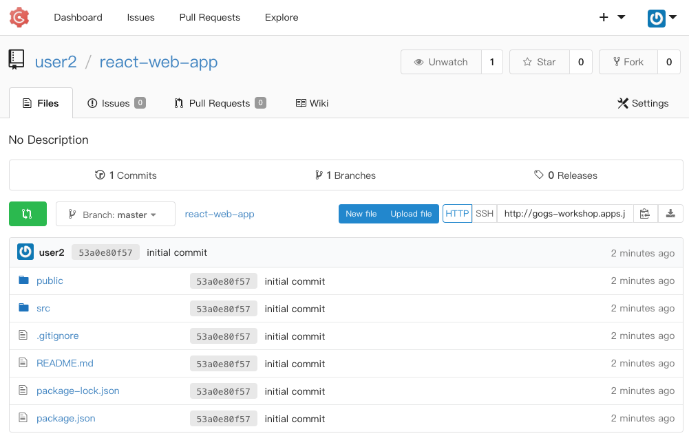

### Create the React App

Let’s start with the React application. We will use create-react-app to create the React app that we will deploy in this workshop. [Click here to learn more about create-react-app](https://github.com/facebook/create-react-app).

Run the following command to create your React app. This may take 1-2 minutes to complete. 

Note: [npx](https://github.com/zkat/npx#readme) is a tool that comes with npm 5.2+ to run one-off commands.

```execute
npx create-react-app react-web-app
```

You should see output like this:

```
npx: installed 63 in 6.227s

Creating a new React app in /opt/app-root/src/react-web-app.

Installing packages. This might take a couple of minutes.
Installing react, react-dom, and react-scripts...

+ react@16.7.0
+ react-dom@16.7.0
+ react-scripts@2.1.3
added 1923 packages in 70.96s

Success! Created react-web-app at /opt/app-root/src/react-web-app
Inside that directory, you can run several commands:

  npm start
    Starts the development server.

  npm run build
    Bundles the app into static files for production.

  npm test
    Starts the test runner.

  npm run eject
    Removes this tool and copies build dependencies, configuration files
    and scripts into the app directory. If you do this, you can’t go back!

We suggest that you begin by typing:

  cd react-web-app
  npm start

Happy hacking!
```

Now, cd into the react-web-app directory:

```execute
cd react-web-app
```

### Store the Code in Your Gogs Repo

OpenShift can work with any accessible Git repository. This could be GitHub,
GitLab, or any other server that speaks Git. You can even register webhooks in
your Git server to initiate OpenShift builds triggered by any update to the
application code!

We've created an empty internal Gogs repository for you located at the following URL:
Click the link and log in. Your Gogs credentials are the same as your OpenShift credentials.

http://gogs-workshop.%cluster_subdomain%/%username%/react-web-app


You probably noticed that it's just an empty repo. Come back to the terminal so we can get everything set up and push your code to the repo:

```execute
git init
git add .
git remote add %username% http://gogs-workshop.%cluster_subdomain%/%username%/react-web-app.git
git config --local user.email "%username%@example.com"
git config --local user.name "%username%"
git commit -m 'initial commit'
git push %username% master
```

Enter your username and password, if prompted. Go refresh the Gogs page in your browser, and now you should see the files there.



### Deploy Using the `serve` Module

Now, we'll use the web-app builder image to deploy our React app. `nodeshift/centos7-s2i-web-app` is the name of the builder image we are using, and we want to use the image with the `10.x` tag. By default, this s2i image uses the `serve` module to serve the generated static files. That behavior is fine for development purposes. Later in the workshop, you will learn how to use this s2i image with NGINX.

```execute
oc new-app nodeshift/centos7-s2i-web-app:10.x~http://gogs-workshop.%cluster_subdomain%/%username%/react-web-app.git
```

You will see output similar to this:

```
Found Docker image e32759a (2 weeks old) from Docker Hub for "nodeshift/centos7-s2i-web-a
pp:10.x"

    Node.js 10.15.0
    ---------------
    Web Application building with Node.js

    Tags: builder, nodejs

    * An image stream will be created as "centos7-s2i-web-app:10.x" that will track the sourc
e image
    * A source build using source code from http://gogs-workshop.apps.jkleinert-5dcc.openshif
tworkshop.com/user5/react-web-app.git will be created
      * The resulting image will be pushed to image stream "react-web-app:latest"
      * Every time "centos7-s2i-web-app:10.x" changes a new build will be triggered
    * This image will be deployed in deployment config "react-web-app"
    * Port 8080/tcp will be load balanced by service "react-web-app"
      * Other containers can access this service through the hostname "react-web-app"

--> Creating resources ...
    imagestream "centos7-s2i-web-app" created
    imagestream "react-web-app" created
    buildconfig "react-web-app" created
    deploymentconfig "react-web-app" created
    service "react-web-app" created
--> Success
    Build scheduled, use 'oc logs -f bc/react-web-app' to track its progress.
    Application is not exposed. You can expose services to the outside world by executing one
 or more of the commands below:
     'oc expose svc/react-web-app'
    Run 'oc status' to view your app.
```

Now, run the following command to view the logs and watch the progress of the build:

```execute
oc logs -f bc/react-web-app
```

Finally, once the build is complete, run the following command to create a route (an externally-accessible URL) for the app:

```execute
oc expose svc/react-web-app
oc get routes
```

You should see a route similar to this:

```
NAME            HOST/PORT                                                       PATH      SERVICES        PORT       T
ERMINATION   WILDCARD
react-web-app   react-web-app-user5.apps.jkleinert-5dcc.openshiftworkshop.com             react-web-app   8080-tcp
             None
```

Copy the URL and paste it in a new tab in your browser. Your React app is now running, using the `serve` module!


