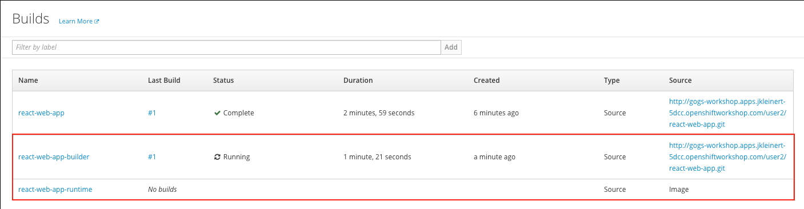
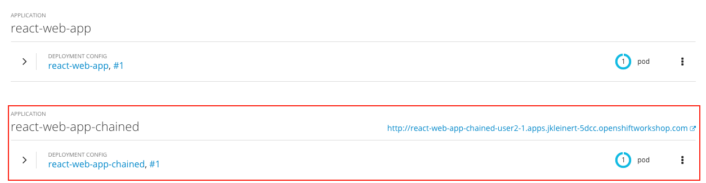
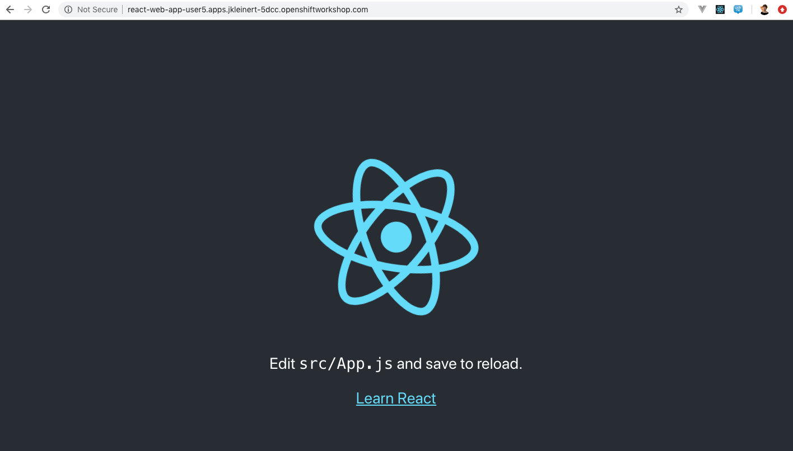

### Deploying the App

Now that we’ve taken a look at the template, let’s see how we can easily deploy this application.

First, let's add the template file. From your `react-web-app` directory, run the following commands:

```execute
mkdir .openshiftio
touch .openshiftio/application.yaml
```

Copy everything from this template: https://raw.githubusercontent.com/jankleinert/react-web-app/master/.openshiftio/application.yaml.

Using either `vi` or `nano` as your editor, open `.openshiftio/application.yaml`, paste in the code, and save the file.

Now that we have our application.yaml template file, let's load it into OpenShift.

```execute
oc apply -f ~/react-web-app/.openshiftio/application.yaml
```
Next, we'll create a new app based on that template. 

```execute
oc new-app  --template react-web-app-chained -p SOURCE_REPOSITORY_URL=http://gogs-workshop.%cluster_subdomain%/%username%/react-web-app.git
```

Running those commands will kick off two new builds. Open the [web console](https://%web_console_url%) and click on **Builds > Builds** in the navigation to view them. 



Once the builds are complete, click **Overview** and you should see the running pod.



Click the route URL to navigate to the application. Just as you saw earlier in the workshop, this should load the Create React App example app, but this time it's running using NGINX rather than the `serve` module. 



Congratulations! Now that you've completed this lab, you know how to use templates, s2i, and chained builds to deploy modern, single page web apps on OpenShift.